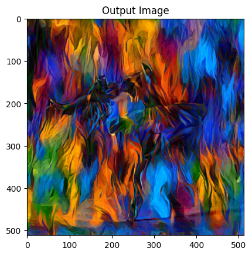
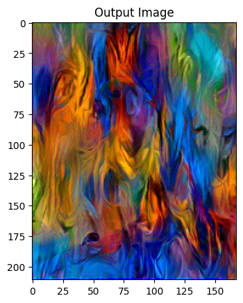
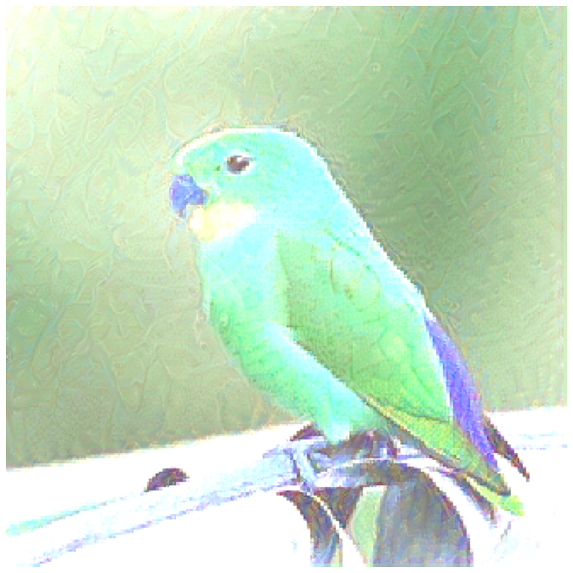
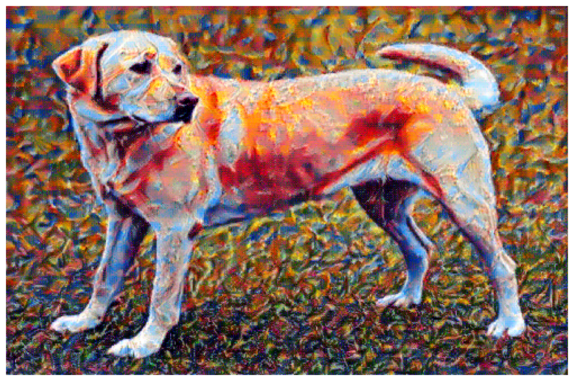
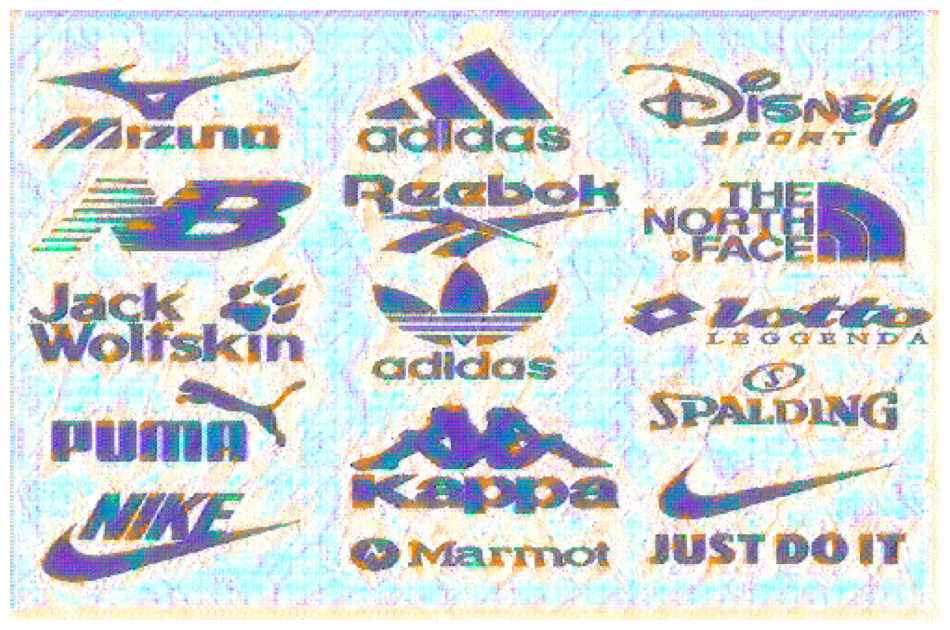
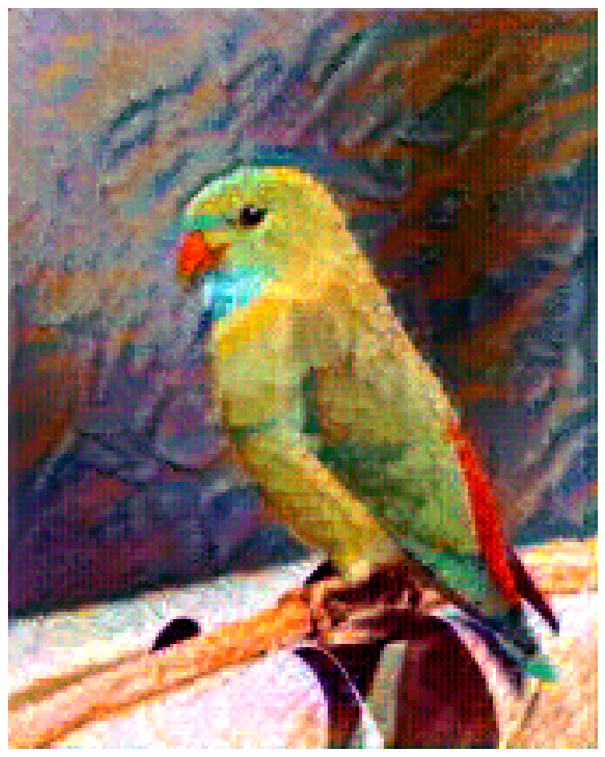
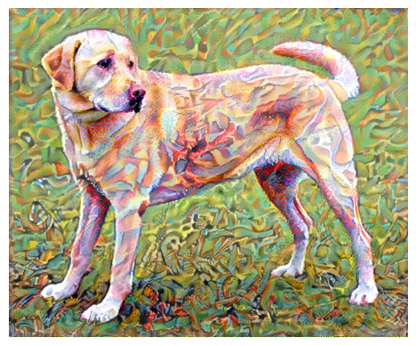

# 🎨 Neural Style Transfer (NST) — Architecture Exploration & Benchmarking

[](https://www.python.org/)
[](https://pytorch.org/)
[](https://www.tensorflow.org/)
[]()
[]()

> An academic research repository exploring, comparing, and benchmarking classical and modern deep learning backbones for **Neural Style Transfer (NST)** across both **PyTorch** and **TensorFlow**. 
> Conducted as part of a faculty-supervised research project under **Aditya Firmansyah**.

---

## 📌 Executive Summary

**Neural Style Transfer (NST)** synthesizes an output image that simultaneously preserves the semantic structures of a **Content Image** ($I_c$) while rendering it in the artistic brushstrokes, textures, and color palette of a **Style Image** ($I_s$).

While the foundational paradigm established by Gatys et al. (2015) relies on VGG-19, modern computer vision has evolved with parameter-efficient and attention-based backbones. This repository implements and compares:

- 🏛️ **VGG-19**: Classical unresidual convolutional baseline (Simonyan & Zisserman, 2014; Gatys et al., 2015).
- ⚡ **EfficientNet-B0 & EfficientNetV2-B0**: Parameter-efficient compound-scaled CNNs (Tan & Le, 2019/2021).
-  Modern **ConvNeXt**: Modernized pure convolutional architecture competing with Vision Transformers (Liu et al., CVPR 2022).
- 👁️ **LeViT**: Fast hybrid Vision Transformer combining convolutional downsamplers and attention blocks (Graham et al., ICCV 2021).
- 🔀 **Multi-Backbone Fusion Model**: Joint content-style optimization drawing features across distinct networks.
- ✂️ **Segmentation-Guided NST**: Foreground vs. background semantic separation via automated masking.

---

## 🖼️ Sample Experimental Results

Below are samples generated by various architectures within this repository:

| Model Architecture | Framework | Iterations | Stylized Output |
| :--- | :---: | :---: | :--- |
| **VGG-19 (Dancing Subject)** | PyTorch | 50,000 |  |
| **VGG-19 (Bird Subject)** | PyTorch | 50,000 |  |
| **ConvNeXt (Bird Subject)** | TensorFlow | 100 |  |
| **EfficientNet-B0 (Dog Subject)** | TensorFlow | 1,500 |  |
| **EfficientNet-B0 (Logo Subject)** | TensorFlow | 1,500 |  |
| **EfficientNetV2-B0 (Bird Subject)** | TensorFlow | 1,500 |  |
| **VGG-19 (Dog Subject)** | TensorFlow | 1,500 |  |

---

## 📁 Repository Structure

```
Neural-Style-Transfer/
├── data/
│   ├── content/                   # Source photographs (JPEG, PNG)
│   │   ├── a.jpg
│   │   ├── a.png
│   │   ├── amazon.jpg
│   │   ├── bird.jpg
│   │   ├── dancing.jpg
│   │   └── someLogo.jpg
│   └── style/                     # Target artistic textures (JPEG, PNG, WEBP)
│       ├── first.webp
│       ├── picasso.jpg
│       ├── second.jpg
│       ├── ss.png                 # RGBA format sample
│       └── third.webp
│
├── notebooks/
│   ├── 00_dataset_exploration_and_starter.ipynb   # 🚀 START HERE: Audit, validation & preview
│   ├── fusion/
│   │   └── 01_fusion_model_nst.ipynb              # Multi-backbone hybrid optimization
│   ├── pytorch/
│   │   ├── 01_vgg19_nst.ipynb                     # Gatys VGG-19 optimization
│   │   ├── 02_efficientnet_b0_nst.ipynb           # EfficientNet-B0 backbone
│   │   └── 03_levit_nst.ipynb                     # LeViT Vision Transformer backbone
│   └── tensorflow/
│       ├── 01_vgg19_nst.ipynb                     # Keras VGG-19 pipeline
│       ├── 02_gatys_baseline_nst.ipynb            # Gatys reference implementation
│       ├── 03_gatys_custom_scratch_nst.ipynb      # Custom Gram & loss from scratch
│       ├── 04_efficientnet_nst.ipynb              # EfficientNet experiments
│       ├── 05_deep_learning_experiments.ipynb     # Feedforward inference prototypes
│       ├── 06_convnext_nst.ipynb                  # ConvNeXt modern backbone
│       ├── 07_efficientnetv2_b0_nst.ipynb         # EfficientNetV2-B0 pipeline
│       └── 08_paper_based_segmentation_nst.ipynb  # Mask-guided segmentation NST
│
├── results/
│   ├── pytorch/                   # High-iteration PyTorch outputs
│   └── tensorflow/                # TensorFlow model outputs
│
├── docs/
│   ├── research_notes.md          # 🔬 Research roadmap & academic analysis
│   └── archive_catatan.txt        # Initial research notes archive
│
├── .gitignore                     # Git ignore rules for venvs, checkpoints & zips
├── requirements.txt               # Unified project dependencies
└── README.md                      # Project documentation
```

---

## 🔬 Dataset Overview & File Formats

In Neural Style Transfer, the "dataset" consists of sample **Content** and **Style** images rather than thousands of labeled training instances:

| Modality | Description | Files Included | File Types |
| :--- | :--- | :--- | :--- |
| **Content Images** | Structural subjects (edges, scenes, objects) to retain | `bird.jpg`, `dancing.jpg`, `amazon.jpg`, `someLogo.jpg`, etc. | `.jpg`, `.png` |
| **Style Images** | Textural patterns, brushwork, and palettes to transfer | `picasso.jpg`, `second.jpg`, `first.webp`, `ss.png`, etc. | `.jpg`, `.png`, `.webp` |

### ⚠️ Preprocessing Gotchas Handled in This Repo:
1. **4-Channel RGBA Images (`ss.png`)**: Standard CNNs require 3-channel RGB. Passing an RGBA tensor triggers input channel mismatch errors. All pipelines and the starter notebook auto-convert to RGB.
2. **WebP Compression (`first.webp`, `third.webp`)**: Modern Google format requiring Pillow/PIL decoding before tensor transformation.
3. **High Resolution Guard (`first.webp` = 1800×2352)**: High-resolution images cause GPU OOM during Gram matrix computation. The starter notebook downscales inputs to max 512px while maintaining exact aspect ratio.

👉 Run **[`notebooks/00_dataset_exploration_and_starter.ipynb`](notebooks/00_dataset_exploration_and_starter.ipynb)** for automated audit and visual validation!

---

## 📊 Architectural Comparison

| Architecture | Paradigm | Params | Inductive Bias | Style Transfer Viability |
| :--- | :---: | :---: | :--- | :--- |
| **VGG-19** | Standard CNN | ~143M | High spatial locality, unresidual features | ⭐⭐⭐⭐⭐ Ideal: Gram matrices capture textural correlations stably |
| **EfficientNet-B0** | Compound Scaled | ~5.3M | Depthwise separable convs + SE blocks | ⭐⭐⭐ Good content fidelity, compact memory |
| **ConvNeXt** | Modern CNN | ~28M | 7x7 inverted bottleneck, LayerNorm | ⭐⭐⭐⭐ Rich multi-scale feature hierarchies |
| **LeViT** | CNN-ViT Hybrid | ~13M | Attention heads + conv subsampling | ⭐⭐⭐ Interesting global texture blending |
| **Fusion Model** | Multi-Backbone | Variable | Combines diverse representational layers | ⭐⭐⭐⭐ Highly customizable style blending |

---

## ⚡ Quickstart & Installation

### 1. Clone the Repository
```bash
git clone https://github.com/Akma86/Neural-Style-Transfer.git
cd Neural-Style-Transfer
```

### 2. Set Up a Python Virtual Environment
```bash
# Using Python 3.10+ or 3.12
python -m venv .venv

# Activate environment:
# On Windows (PowerShell):
.venv\Scripts\Activate.ps1
# On Linux/macOS:
source .venv/bin/activate
```

### 3. Install Dependencies
```bash
pip install --upgrade pip
pip install -r requirements.txt
```

### 4. Launch Jupyter & Start with the Dataset Explorer
```bash
jupyter notebook notebooks/00_dataset_exploration_and_starter.ipynb
```

---

## 🚀 How to Run Experiments

### PyTorch Workflow
Navigate to `notebooks/pytorch/`:
1. Open **`01_vgg19_nst.ipynb`** for the Gatys et al. L-BFGS / Adam optimization.
2. Adjust `style_weight` ($10^5$ to $10^6$) and `content_weight` ($1$) to control stylization strength.
3. Run optimization iterations to synthesize the output.

### TensorFlow Workflow
Navigate to `notebooks/tensorflow/`:
1. Open **`01_vgg19_nst.ipynb`** or **`06_convnext_nst.ipynb`**.
2. Run gradient descent with `tf.GradientTape()` minimizing total loss:
   $$\mathcal{L}_{total} = \alpha \mathcal{L}_{content} + \beta \mathcal{L}_{style} + \gamma \mathcal{L}_{tv}$$

### Segmentation-Guided Transfer
Open **`notebooks/tensorflow/08_paper_based_segmentation_nst.ipynb`** to apply style selectively across subject foreground and background.

---

## 🔬 Research & Roadmap Notes

For detailed documentation on research inquiries (multi-style blending, audio/cross-domain transfer, semantic segmentation integration, and academic questions investigated under supervisor **Aditya Firmansyah**), see:
📄 **[`docs/research_notes.md`](docs/research_notes.md)**

---

## 📚 References & Academic Citations

1. Gatys, L. A., Ecker, A. S., & Bethge, M. (2015). *A Neural Algorithm of Artistic Style*. [arXiv:1508.06576](https://arxiv.org/abs/1508.06576).
2. Simonyan, K., & Zisserman, A. (2014). *Very Deep Convolutional Networks for Large-Scale Image Recognition*. [arXiv:1409.1556](https://arxiv.org/abs/1409.1556).
3. Johnson, J., Alahi, A., & Fei-Fei, L. (2016). *Perceptual Losses for Real-Time Style Transfer and Super-Resolution*. ECCV.
4. Tan, M., & Le, Q. V. (2019). *EfficientNet: Rethinking Model Scaling for Convolutional Neural Networks*. ICML.
5. Liu, Z., et al. (2022). *A ConvNet for the 2020s*. CVPR.
6. Graham, B., et al. (2021). *LeViT: a Vision Transformer in disguise for high-speed inference*. ICCV.

---

## 👤 Author & Acknowledgments

- **Researcher**: [Akmal Yaasir Fauzaan](https://github.com/Akma86) (Research Assistant)
- **Supervision**: Aditya Firmansyah
- **Repository**: [Neural-Style-Transfer](https://github.com/Akma86/Neural-Style-Transfer)
