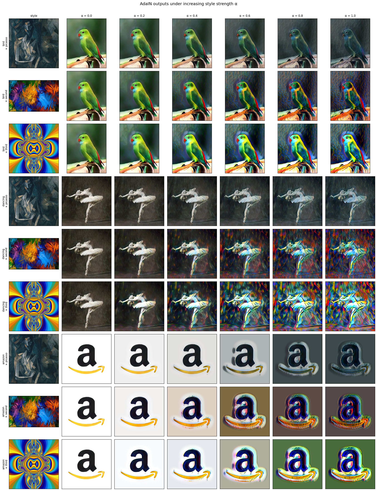
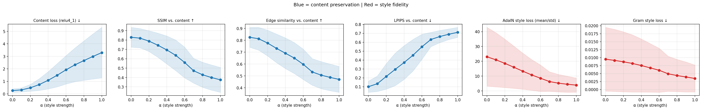
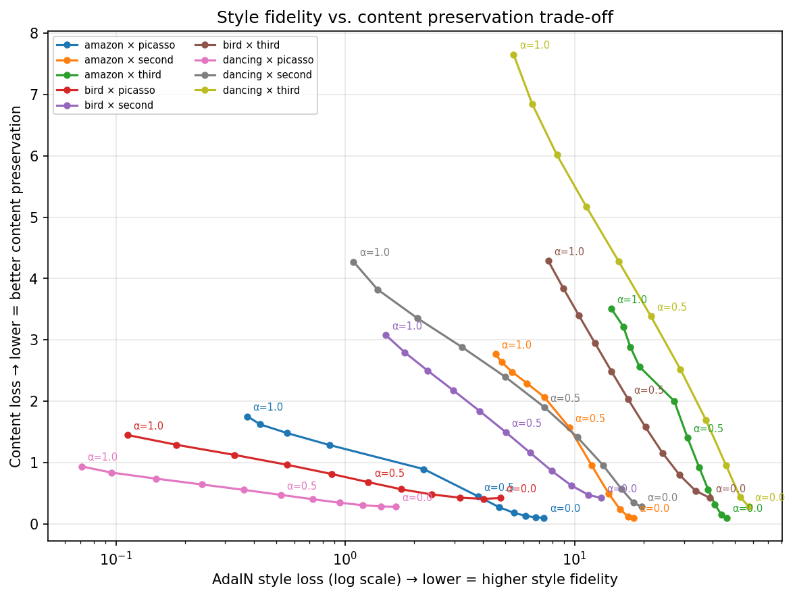
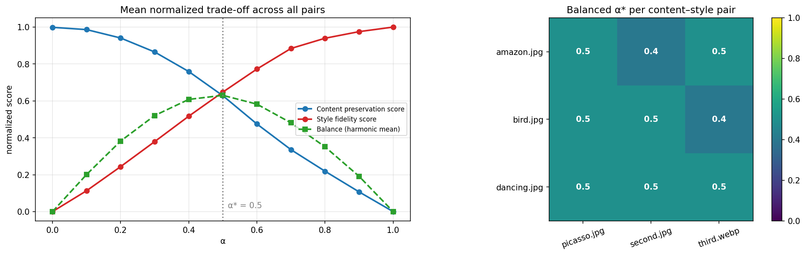

# 🎨 Analyzing the Trade-off Between Style Fidelity and Content Preservation in AdaIN-Based Neural Style Transfer under Different Style Strengths

[](https://www.python.org/)
[](https://pytorch.org/)
[](https://www.tensorflow.org/)
[]()
[]()

> **Abstract**: Adaptive Instance Normalization (AdaIN; Huang & Belongie, 2017) enables real-time arbitrary neural style transfer by aligning the channel-wise feature statistics (mean and standard deviation) of a content image with those of a style image in the latent space of a pretrained VGG-19 encoder. A pivotal yet under-characterized mechanism of AdaIN is the **style-strength parameter** $\alpha \in [0, 1]$, which linearly interpolates feature activations between the content representation and the stylized AdaIN output before decoding. This research investigates the quantitative and qualitative trade-off between **style fidelity** and **content preservation** across varying $\alpha$ thresholds, providing an empirical framework to identify the optimal balanced operating point $\alpha^*$.

---

## 👥 Authors & Research Team

| Author | Email |
| :--- | :--- |
| **Akmal Yaasir Fauzaan** | [`akmalyaasirfauzaan@student.telkomuniversity.ac.id`](mailto:akmalyaasirfauzaan@student.telkomuniversity.ac.id) |
| **Alifia Azzahra** | [`fiazfzar@student.telkomuniversity.ac.id`](mailto:fiazfzar@student.telkomuniversity.ac.id) |
| **Ukasyah** | [`ukasyahu@student.telkomuniversity.ac.id`](mailto:ukasyahu@student.telkomuniversity.ac.id) |

**Academic Affiliation**: Telkom University  
**Research Supervision**: Aditya Firmansyah  

---

## 🔬 Research Problem & Hypotheses

### Mathematical Formulation
Given content image $c$ and style image $s$, let $f(\cdot)$ denote a frozen VGG-19 encoder truncated at `relu4_1`, and $g(\cdot)$ denote a trained decoder that inverts latent representations back into RGB space. The AdaIN feature transfer is defined as:

$$\text{AdaIN}(f(c), f(s)) = \sigma(f(s)) \left( \frac{f(c) - \mu(f(c))}{\sigma(f(c))} \right) + \mu(f(s))$$

The **content–style trade-off** is governed by $\alpha \in [0.0, 1.0]$:

$$T(c, s, \alpha) = g\Big(\alpha \cdot \text{AdaIN}(f(c), f(s)) + (1 - \alpha) \cdot f(c)\Big)$$

- **$\alpha = 0.0$**: Pure content reconstruction ($g(f(c))$), zero style transfer.
- **$\alpha = 1.0$**: Full AdaIN stylization, maximum style transfer.
- **$\alpha \in (0, 1)$**: Continuous feature-space interpolation balancing semantics and aesthetics.

### Research Questions & Hypotheses
- **RQ1**: How do content preservation (SSIM, Edge Correlation, Perceptual Content Loss) and style fidelity (AdaIN Loss, Gram Loss) behave as $\alpha$ scales from $0.0$ to $1.0$?
  - *H1 (Confirmed)*: Style loss decreases monotonically ($\text{Spearman } \rho = -1.000$).
  - *H2 (Confirmed)*: Content loss increases monotonically ($\rho = +0.999$), while structural similarity (SSIM) degrades ($\rho = -0.998$).
- **RQ2**: Is the trade-off strictly linear, or does style fidelity plateau while content distortion accelerates?
  - *Findings*: The trade-off exhibits a clear Pareto elbow. Style gains largely plateau past $\alpha \ge 0.7$, while content degradation continues to rise sharply.
- **RQ3**: Does an optimal, balanced style strength $\alpha^*$ exist across diverse content–style combinations?
  - *Findings*: Across all tested pairs, the harmonic balance score peaks consistently between **$\alpha^* \in [0.4, 0.5]$** (global mean $\alpha^* = 0.50$).

---

## 📊 Empirical Findings & Visual Results

### 1. Visual Progression Across Style Strength $\alpha$
Below is the qualitative progression across 9 distinct content–style pairs as $\alpha$ increases from $0.0$ to $1.0$:



---

### 2. Quantitative Metric Trajectories
Trajectories of content preservation metrics (blue) vs. style fidelity metrics (red) evaluated over 99 systematic experiments:



| Style Strength $\alpha$ | Content Loss $\mathcal{L}_c$ ↓ | SSIM vs. Content ↑ | Edge Similarity ↑ | AdaIN Style Loss $\mathcal{L}_s$ ↓ | Gram Style Loss $\mathcal{L}_{gram}$ ↓ |
| :---: | :---: | :---: | :---: | :---: | :---: |
| **0.0** (Reconstruction) | 0.2663 | 0.8293 | 0.8257 | 23.0352 | 0.00950 |
| **0.1** | 0.3184 | 0.8197 | 0.8133 | 21.0023 | 0.00910 |
| **0.2** | 0.4852 | 0.7883 | 0.7770 | 18.5999 | 0.00870 |
| **0.3** | 0.7465 | 0.7443 | 0.7323 | 16.0173 | 0.00820 |
| **0.4** | 1.0874 | 0.6939 | 0.6911 | 13.3404 | 0.00750 |
| **0.5 (Optimal $\alpha^*$)** | **1.4875** | **0.6364** | **0.6503** | **10.8067** | **0.00680** |
| **0.6** | 1.9257 | 0.5602 | 0.5975 | 8.5547 | 0.00600 |
| **0.7** | 2.3242 | 0.4725 | 0.5337 | 6.3161 | 0.00490 |
| **0.8** | 2.6632 | 0.4293 | 0.5067 | 5.2347 | 0.00440 |
| **0.9** | 2.9900 | 0.3998 | 0.4877 | 4.5029 | 0.00390 |
| **1.0** (Full Style) | 3.3007 | 0.3752 | 0.4710 | 3.9191 | 0.00347 |

---

### 3. Pareto Trade-off Curve & Balanced $\alpha^*$
The relationship between content degradation and style convergence reveals the exact operating frontier:

| Pareto Trade-off Frontier | Harmonic Balance Curve & $\alpha^*$ Heatmap |
| :---: | :---: |
|  |  |

---

### 4. Style Sensitivity Analysis
Different artistic styles exert varying levels of disruption on underlying scene geometry:

| Style Image | Content Sensitivity ($\Delta\mathcal{L}_c / \Delta\alpha$) | Style Gain (%) | Final SSIM ($\alpha=1.0$) | Recommended $\alpha^*$ |
| :--- | :---: | :---: | :---: | :---: |
| `third.webp` (Complex Abstract) | **3.673** (High disruption) | 83.1% | 0.354 | **0.4** |
| `second.jpg` (Vibrant Impressionist) | **3.080** (Moderate disruption) | 82.8% | 0.377 | **0.4 – 0.5** |
| `picasso.jpg` (Cubist Palette) | **2.673** (Low disruption) | 83.0% | 0.395 | **0.5** |

---

## 🚀 How to Run the AdaIN Style-Strength Notebook

The main paper experiment is fully implemented in:
👉 **[`notebooks/adain/01_adain_style_strength_tradeoff.ipynb`](notebooks/adain/01_adain_style_strength_tradeoff.ipynb)**

### Option A: Change `ALPHA` in the Configuration Cell
Open the notebook and edit Section 1:
```python
# --- Single-run style strength (adjust this!) ---
ALPHA = 0.6          # Any float in [0.0, 1.0]

SINGLE_CONTENT = "bird.jpg"
SINGLE_STYLE   = "picasso.jpg"
```
Execute the cell to produce instant single-pass stylization in **~40 ms**.

### Option B: Interactive Slider (`ipywidgets`)
Run Section 6 in Jupyter or VS Code to adjust $\alpha$ in real time with an interactive slider:
```python
# Feature encodings are cached, so moving the slider runs only the decoder in real time!
widgets.interact(_show, alpha=(0.0, 1.0, 0.05), content_name=..., style_name=...)
```

### Option C: Re-run the Systematic Sweep
Section 8 iterates over `SWEEP_CONTENTS × SWEEP_STYLES` across `ALPHA_SWEEP = [0.0, 0.1, ..., 1.0]`, saving all generated images, metric CSVs, and visualization figures directly to `results/adain/`.

---

## 📁 Repository Structure

```
Neural-Style-Transfer/
├── data/
│   ├── content/                                  # Source images (bird, dancing, amazon, logo, etc.)
│   └── style/                                    # Target artworks (picasso, second, third.webp, ss.png)
│
├── notebooks/
│   ├── adain/                                    # 📄 CORE PAPER IMPLEMENTATION
│   │   └── 01_adain_style_strength_tradeoff.ipynb# Full alpha analysis, metrics, interactive slider & sweep
│   ├── 00_dataset_exploration_and_starter.ipynb  # Dataset audit, WEBP handling & RGBA sanitization
│   ├── fusion/
│   │   └── 01_fusion_model_nst.ipynb             # Multi-backbone hybrid optimization
│   ├── pytorch/
│   │   ├── 01_vgg19_nst.ipynb                     # Gatys et al. iterative baseline
│   │   ├── 02_efficientnet_b0_nst.ipynb           # EfficientNet-B0 backbone
│   │   └── 03_levit_nst.ipynb                     # Vision Transformer (LeViT) backbone
│   └── tensorflow/
│       ├── 01_vgg19_nst.ipynb                     # Keras VGG-19 implementation
│       ├── 02_gatys_baseline_nst.ipynb            # Gatys reference model
│       ├── 03_gatys_custom_scratch_nst.ipynb      # Custom Gram calculation
│       ├── 04_efficientnet_nst.ipynb              # EfficientNet experiments
│       ├── 05_deep_learning_experiments.ipynb     # Feedforward prototypes
│       ├── 06_convnext_nst.ipynb                  # Modern ConvNeXt backbone
│       ├── 07_efficientnetv2_b0_nst.ipynb         # EfficientNetV2-B0 pipeline
│       └── 08_paper_based_segmentation_nst.ipynb  # Mask-guided semantic segmentation NST
│
├── results/
│   ├── adain/                                    # 📊 PAPER RESULTS & EXPERIMENTAL ARTIFACTS
│   │   ├── figures/                               # Trade-off curves, heatmap, alpha progression grid
│   │   ├── alpha_sweep_metrics.csv                # Complete quantitative evaluation data
│   │   ├── balanced_alpha_per_pair.csv            # Computed optimal alpha* per image pair
│   │   ├── style_sensitivity.csv                  # Style-specific destruction rate ranking
│   │   └── images/                                # 99 generated stylization samples (alpha 0.0 - 1.0)
│   ├── pytorch/                                  # Gatys high-iteration renders
│   └── tensorflow/                               # TensorFlow baseline renders
│
├── docs/
│   ├── research_notes.md                          # Academic roadmap, inquiries & theoretical analysis
│   └── archive_catatan.txt                        # Original brainstorming notes archive
│
├── models/adain/                                 # Pretrained weights (downloaded on demand; git-ignored)
├── .gitignore                                     # Clean ignore rules for checkpoints, venvs & weights
├── requirements.txt                               # Environment dependencies
└── README.md                                      # Comprehensive research documentation
```

---

## ⚡ Installation & Quickstart

### 1. Clone the Repository
```bash
git clone https://github.com/Akma86/Neural-Style-Transfer.git
cd Neural-Style-Transfer
```

### 2. Set Up Virtual Environment
```bash
python -m venv .venv

# On Windows PowerShell:
.venv\Scripts\Activate.ps1
# On Linux/macOS:
source .venv/bin/activate
```

### 3. Install Dependencies
```bash
pip install --upgrade pip
pip install -r requirements.txt
```

### 4. Launch the AdaIN Paper Notebook
```bash
jupyter notebook notebooks/adain/01_adain_style_strength_tradeoff.ipynb
```
*(Pretrained encoder and decoder weights download automatically on first run into `models/adain/`.)*

---

## 🏛️ Comparative Baseline Architectures

In addition to feedforward AdaIN, this repository benchmarks iterative optimization across five distinct backbones:

| Backbone | Architecture Type | Parameters | Inductive Bias | Viability for Style Transfer |
| :--- | :---: | :---: | :--- | :--- |
| **VGG-19** | Classical CNN | ~143M | High spatial locality, unresidual features | ⭐⭐⭐⭐⭐ Benchmark standard |
| **EfficientNet-B0** | Compound Scaled | ~5.3M | Depthwise separable convs + SE blocks | ⭐⭐⭐ Compact memory, fast |
| **ConvNeXt** | Modern ConvNet | ~28M | 7×7 depthwise convs, inverted bottleneck | ⭐⭐⭐⭐ Rich multi-scale hierarchy |
| **LeViT** | CNN-ViT Hybrid | ~13M | Multi-head attention + conv downsamplers | ⭐⭐⭐ Attention-guided texture |
| **AdaIN (Ours)** | Normalization-based | ~3.5M (dec) | Channel-wise moment matching | ⭐⭐⭐⭐⭐ **Instant (~40ms), tunable $\alpha$** |

---

## 📚 References & Academic Citations

```bibtex
@inproceedings{huang2017adain,
  title     = {Arbitrary Style Transfer in Real-time with Adaptive Instance Normalization},
  author    = {Huang, Xun and Belongie, Serge},
  booktitle = {IEEE International Conference on Computer Vision (ICCV)},
  year      = {2017}
}

@inproceedings{gatys2016image,
  title     = {Image Style Transfer Using Convolutional Neural Networks},
  author    = {Gatys, Leon A and Ecker, Alexander S and Bethge, Matthias},
  booktitle = {IEEE Conference on Computer Vision and Pattern Recognition (CVPR)},
  year      = {2016}
}

@article{wang2004image,
  title     = {Image Quality Assessment: From Error Visibility to Structural Similarity},
  author    = {Wang, Zhou and Bovik, Alan C and Sheikh, Hamid R and Simoncelli, Eero P},
  journal   = {IEEE Transactions on Image Processing},
  volume    = {13},
  number    = {4},
  pages     = {600--612},
  year      = {2004}
}
```
